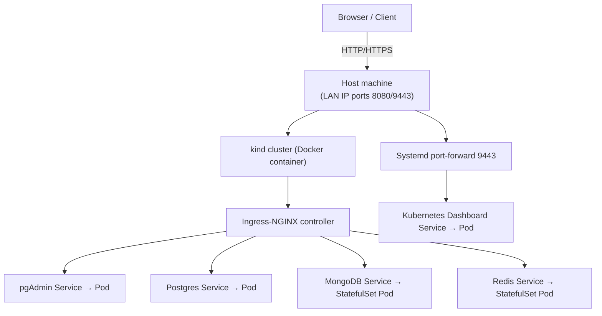

# Kubernetes Demo – Learning Setup

This repository contains a **Kubernetes demo environment** built with [kind](https://kind.sigs.k8s.io/) (Kubernetes in Docker).  
It is designed **for learning purposes only** — not for production.

The cluster runs several common services:

- **Postgres** (database)  
- **pgAdmin** (Postgres web UI)  
- **MongoDB** (database)  
- **Redis** (in-memory datastore)  
- **Kubernetes Dashboard** (web UI for managing the cluster)  
- **ingress-nginx** (for routing HTTP traffic into the cluster)  

All manifests are under the [`infra/`](infra/) folder. Bootstrap script is in root folder of the repository.

---

## 📂 Repository structure

```
infra/
├─ kind-ingress.yaml # kind cluster config with ingress ports mapped
├─ app.yaml.tmpl # main manifest (with placeholders for passwords)
├─ k8s-dashboard.service.tmpl # systemd service template for Dashboard port-forward
scripts/
└─ bootstrap.sh # one-shot script to create cluster and deploy everything
.githooks/
└─ pre-commit # git pre-commit hook (blocks committing secrets)

```

---

## 🚀 Getting started

1. **Install Docker** (required for kind).  
   - [Docker Engine Install Docs](https://docs.docker.com/engine/install/)

2. **Clone this repo**  
    ```bash
    git clone https://github.com/yourname/k8s-demo.git
    cd k8s-demo
    ```
 
3. **Run the bootstrap script**
This installs kubectl and kind (if missing), creates the cluster, installs ingress, Dashboard, generates secrets, and applies your manifests.```
    ```bash
    chmod +x bootstrap.sh
    ./bootstrap.sh
    ```
4. **Access Kubernetes Dashboard**

    The script installs a systemd unit (k8s-dashboard.service) which runs a port-forward on 9443 → 443.

    Open: https://localhost:9443 (or https://<HOST-LAN-IP>:9443 from another machine).

    Login using the token printed at the end of bootstrap.sh.

5. **Access pgAdmin**

    Via ingress at the mapped host port (see infra/kind-ingress.yaml).

    Example: http://localhost:8080

## 🔑 Secrets & passwords
infra/app.yaml.tmpl uses placeholders:

```yaml
<postgres-password>

<postgres-ui-password>

<mongo-password>

<redis-password>
```

The bootstrap.sh script replaces these with generated or user-supplied passwords before applying.
The generated infra/app.yaml is gitignored and should never be committed.

## 🛠 Development workflow
1. Manifests live in infra/*.tmpl
2. Run ./bootstrap.sh to (re)deploy
3. Use kubectl or the Dashboard to explore pods, services, ingresses 
4. Git hooks prevent committing real secrets or generated files

## 🗺 Architecture (high level)

External clients connect to your host machine LAN IP (e.g. 192.168.1.x:8080).

Traffic is forwarded into the kind cluster → ingress-nginx → services/pods.

The Dashboard is exposed separately via a systemd kubectl port-forward to port 9443.

## 📚 Documentation / References
This setup was pieced together for learning, using:

[kind – Kubernetes in Docker](https://kind.sigs.k8s.io/docs/user/quick-start/)

[Kubernetes Concepts](https://kubernetes.io/docs/concepts/)

[Kubernetes Dashboard](https://github.com/kubernetes/dashboard)

[Ingress-NGINX Controller](https://kubernetes.github.io/ingress-nginx/)

[Postgres Docker Image](https://hub.docker.com/_/postgres)

[pgAdmin Docker Image](https://hub.docker.com/r/dpage/pgadmin4)

[MongoDB Docker Image](https://hub.docker.com/_/mongo)

[Redis Docker Image](https://hub.docker.com/_/redis)


### ⚠️ Disclaimer

This is a demo project for educational purposes.

Security is minimal (basic secrets, self-signed certs, no TLS hardening).

Not intended for production or storing sensitive data.